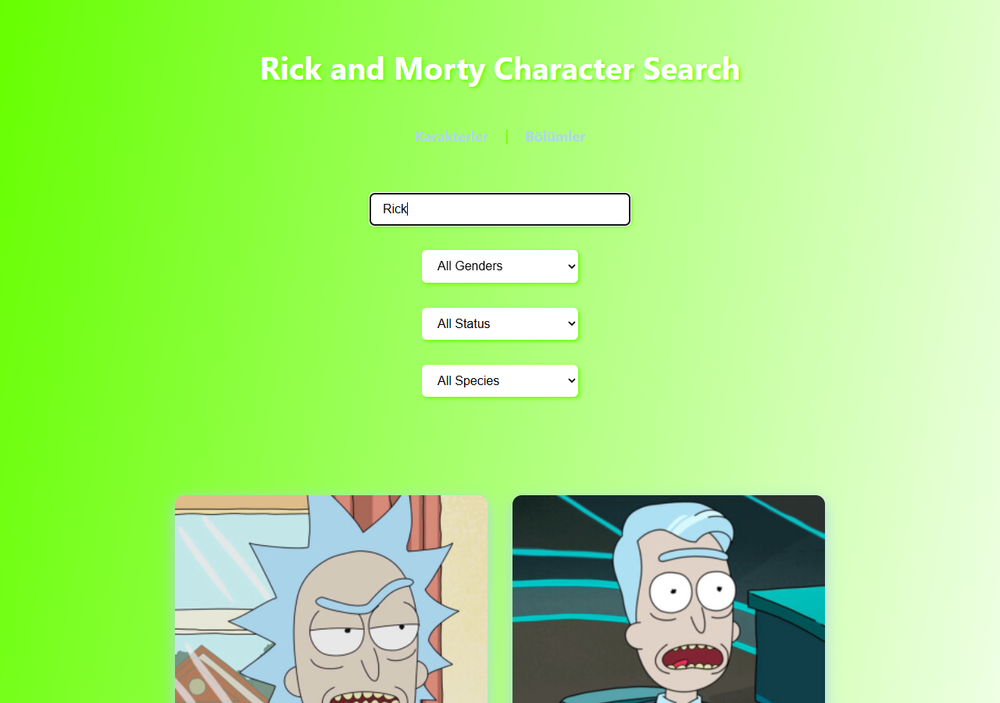
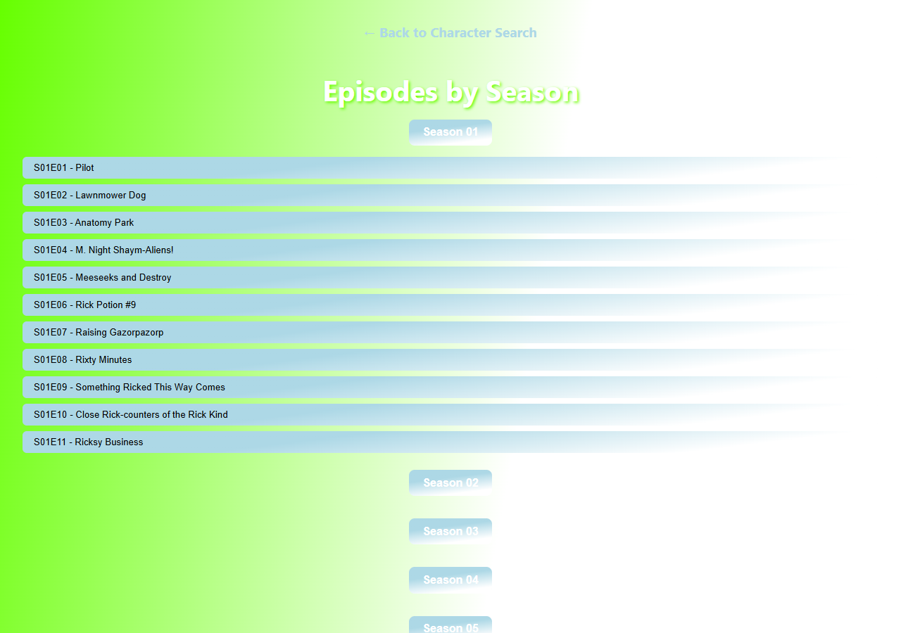

# Rick and Morty Character Search App

Rick and Morty API üzerinden karakter arama, filtreleme ve bölüm detaylarını görüntüleme imkanı sunan bir React SPA. Kullanıcı en az 3 karakter girerek arama yapabilir, status/gender/species filtrelerini kombine edebilir ve bölümleri sezonlara göre gruplanmış accordion yapısında inceleyebilir.


---

## Ekran Goruntuleri

### Ana Sayfa — Karakter Arama ve Filtreleme



### Karakter Detay Sayfasi


### Bolum Listesi



---

## Ozellikler

**Karakter Arama:** Arama kutusuna en az 3 karakter girildiginde Rick and Morty API'ye istek atilir ve sonuclar anlık olarak karakter kartlari seklinde listelenir. Her tuş vurusunda yeni bir istek gider, debounce uygulanmamistir.

**Filtreleme:** Status (Alive, Dead, Unknown), Gender (Male, Female, Genderless, Unknown) ve Species (Human, Alien, Robot, Animal) filtreleri mevcuttur. Filtreler arama ile birlikte API query parametresi olarak gonderilir, client-side filtreleme yapilmaz.

**Karakter Detay:** Karakter kartina tiklandiginda `/character/:id` route'una yonlendirilir. Bu sayfada karakterin gorseli, status, species, gender, son bilinen lokasyon ve ilk gorundugu bolumun adi (ayri bir API istegi ile cekilir) gosterilir.

**Bolum Listesi:** `/episodes` sayfasinda API'deki tum bolumler pagination ile cekilir ve bolum kodu uzerinden (ornegin `S01E05`) sezonlara gore gruplandırılır. Her sezon bir accordion butonu olarak render edilir; tiklandiginda o sezonun bolumleri acilir.

**Bolum Detay:** Bir bolume tiklandiginda `/episode/:id` sayfasinda bolumun adi, yayin tarihi, bolum kodu ve o bolumde yer alan tum karakterlerin kartlari `Promise.all` ile paralel cekilip listelenir.

---

## Teknolojiler

| Teknoloji | Versiyon | Rol |
|-----------|----------|-----|
| React | 19.1.0 | UI katmanı |
| React Router DOM | 7.6.3 | Client-side routing |
| React Scripts | 5.0.1 | CRA build toolchain |
| Rick and Morty API | v1 | Karakter ve bolum verisi |
| Vanilla CSS | - | Gradient, animasyon, responsive layout |

---

## Kurulum

```bash
git clone https://github.com/Tuna-hero/rick-and-morty-character-search-app.git
cd rick-and-morty-character-search-app
npm install
npm start
```

Uygulama `http://localhost:3000` adresinde ayaga kalkar. API anahtari gerekmez, Rick and Morty API tamamen acik ve ucretsizdir.

### Diger Komutlar

```bash
npm run build    # Production build olusturur
npm test         # Test runner baslatir
```

---

## Proje Yapisi

```
src/
├── components/
│   ├── CharacterCard.jsx         # Tek bir karakter icin kart bileşeni (gorsel, isim, status dot, lokasyon)
│   ├── SearchBar.jsx             # Arama inputu + 3 filtre dropdown'ı bir arada
│   └── filters/
│       ├── GenderFilter.jsx      # Gender seceneklerini iceren select
│       ├── SpeciesFilter.jsx     # Species seceneklerini iceren select
│       └── StatusFilter.jsx      # Status seceneklerini iceren select
│
├── pages/
│   ├── CharacterListPage.jsx     # Ana sayfa: arama, filtreleme, sonuc listesi
│   ├── CharacterDetailPage.jsx   # Tekil karakter detay sayfasi
│   ├── EpisodeListPage.jsx       # Sezonlara gore grupli bolum listesi
│   └── EpisodeDetailPage.jsx     # Bolum detay + o bolumdeki karakterler
│
├── styles/
│   ├── App.css                   # Genel layout, nav, input, select, hata mesaji
│   ├── CharacterCard.css         # Kart stili, hover efekti, status dot renkleri, responsive
│   └── EpisodeListPage.css       # Sezon butonlari, bolum butonlari, accordion
│
├── utils/
│   └── api.js                    # searchCharactersByName() — name + filters ile API cagirisi
│
├── App.js                        # Router tanimlamalari (4 route)
└── index.js                      # ReactDOM.createRoot ile render
```

---

## Routing

| Route | Sayfa | Ne Yapar |
|-------|-------|----------|
| `/` | CharacterListPage | Karakter arama ve filtreleme |
| `/character/:id` | CharacterDetailPage | Secilen karakterin tum detaylari |
| `/episodes` | EpisodeListPage | Tum bolumler sezonlara gore gruplanmis |
| `/episode/:id` | EpisodeDetailPage | Bolum bilgisi + o bolumdeki karakterler |

---

## API Kullanimi

Proje [Rick and Morty API](https://rickandmortyapi.com/documentation) kullanir. Kimlik dogrulama gerektirmez.

| Endpoint | Nerede Kullaniliyor |
|----------|---------------------|
| `GET /api/character/?name=&status=&gender=&species=` | CharacterListPage — arama ve filtreleme |
| `GET /api/character/{id}` | CharacterDetailPage — tekil karakter |
| `GET /api/episode` (tum sayfalar) | EpisodeListPage — pagination ile tum bolumlerin cekilmesi |
| `GET /api/episode/{id}` | EpisodeDetailPage — tekil bolum ve karakter URL'leri |

---

## Bilesen Prop Referansi

### CharacterCard

| Prop | Tip | Aciklama |
|------|-----|----------|
| `character` | Object | API'den donen karakter objesi. `id`, `name`, `image`, `status`, `species`, `location`, `episode` alanlarini icerir. |

### SearchBar

| Prop | Tip | Aciklama |
|------|-----|----------|
| `search` | string | Input'taki mevcut arama metni |
| `onSearchChange` | function | Input degistiginde cagrilir |
| `filters` | Object | `{ status, gender, species }` |
| `onFilterChange` | function | Herhangi bir select degistiginde cagrilir, `e.target.name` ile hangi filtre oldugu anlasilir |

---

## Gelistirme Onerileri

- Karakter kartlarinda ilk bolum URL'i yerine bolum adinin gosterilmesi
- Arama icin debounce eklenmesi (gereksiz API isteklerini onlemek adina)
- Infinite scroll veya sayfalama (pagination) destegi
- Dark mode
- localStorage ile favori karakter kaydetme
- Loading skeleton animasyonlari

---

## Lisans

Egitim amaciyla gelistirilmis acik kaynakli bir projedir.
